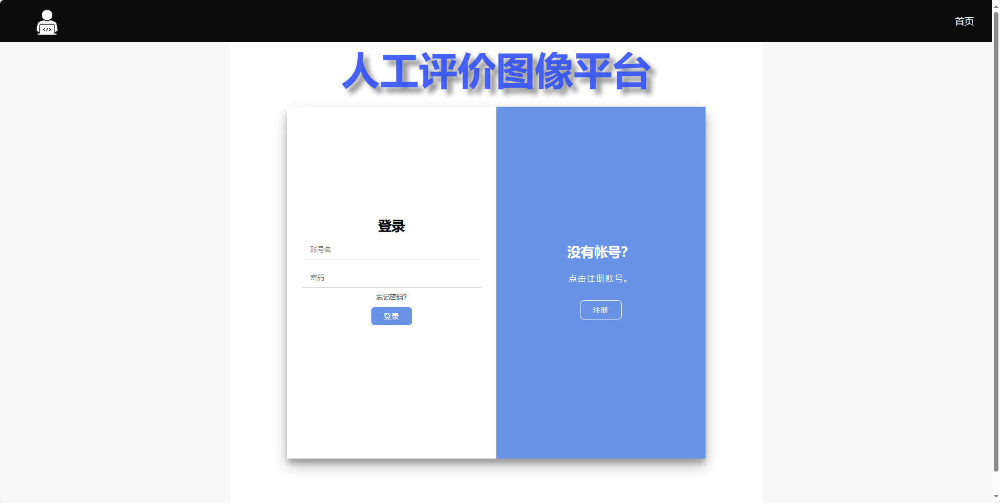

    
  <strong>人工检测图像质量平台的具体设计说明</strong>  

   

 

在 `/src/main/resources/static` 目录中存放前端静态资源。  

 

- **index.html**：平台的初始界面，主要包含受试者信息注册与登录以及管理员登录等功能。
  
- **userPrompt.html**：受试者提示界面，告知受试者如何进行后续实验，并提供部分高视觉质量图像与低视觉质量图像供参考。

- **user.html**：受试者实验界面，主要包含图像的随机选择与展示、倒计时功能及部分交互功能。

- **result.html**：用于提示受试者成功完成实验，并进行数据的保存。  

管理员可以通过登录管理账号 "admin" 来查看数据可视化结果。

 

具体界面如下图所示，访问链接：[http://ttyc.3s.tunnelfrp.com](http://ttyc.3s.tunnelfrp.com)  
(打开网页登录，需联系管理员 email: tangyingchun_131@163.com)  

 

  
  PC端界面  

 

  
  移动端界面    

 

 

在 `/img` 文件夹中存放预先设置的中毒图像。

 

在 `/src/main/java/com/example` 目录中，主要存放后端逻辑代码。主要实现功能由以下部分耦合实现：

- `/controller/UserController.java`
- `/service/UserService.java`
- `/service/impl/UserServiceImpl.java`

通过解耦的方式设计。同时，`/mapper/UserMapper` 主要用于受试者数据的写入，保存至数据库中。
